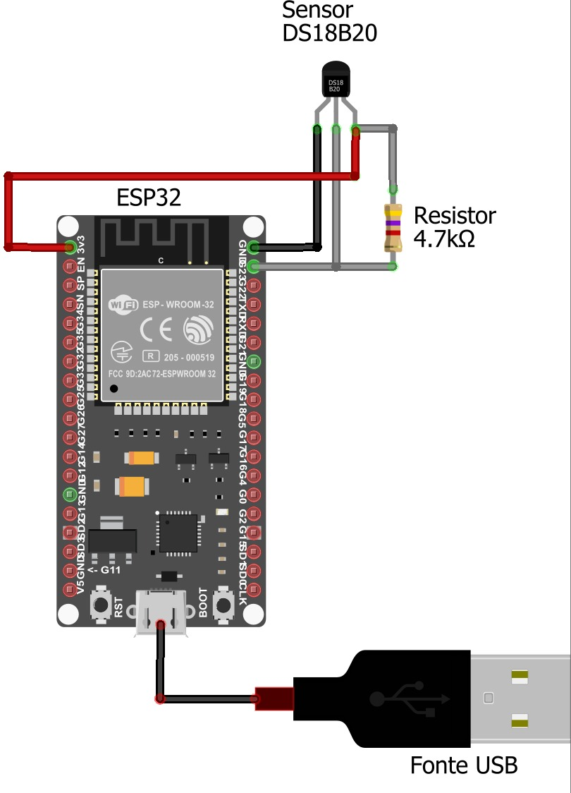

# Conectando Gerações: Termômetro Wifi para Saúde e Bem-Estar
   Este projeto foi desenvolvido para disciplina de Objetos Inteligentes Conectados da Universidade Presbiteriana Mackenzie, sendo orientado pelo Prof. Wallace Rodrigues de Santana, Turma 05J11 - 2024.

# Integrantes
Grupo 05 - Marcelo Scavone Denardi Rodrigues (RA: 10223569), Gabriel Ferreira Carelli (RA: 10395905).

# Descrição do Projeto

   Simulamos um Termômetro Wi-Fi especificamente projetado para o público idoso, utilizando uma Placa de Desenvolvimento ESP32 com um Sensor de Temperatura DS18B20 e um resistor de 4.7kΩ como pullup, o dispositivo monitora continuamente a temperatura corporal e envia esses dados vitais diretamente aos cuidadores por meio de um bot no Telegram, o Veinho Bot. A placa ESP32 lê os dados do sensor de temperatura e envia mensagens via protocolo MQTT para um broker, o Node-RED atua como subscriber, processa as mensagens recebidas, aplica regras de negócio, armazena os dados no InfluxDB e envia alertas via Telegram se a temperatura estiver fora dos parâmetros normais. Utilizando o Grafana, os dados são consumidos e analisados de forma eficiente em um dashboard, logo, este projeto está alinhado com a ODS 3 da ONU, que visa assegurar uma vida saudável e promover o bem-estar para todos.

# Monitoramento de Temperatura Corporal com ESP32 e DS18B20

Essa sessão do projeto demonstra como configurar um ESP32 para monitorar a temperatura corporal de idosos usando um sensor DS18B20 e enviar os dados de temperatura via MQTT para um broker (HiveMQ).

## Requisitos

### Hardware

- ESP32
- Sensor de Temperatura DS18B20
- Resistor de 4.7kΩ

### Montagem do Hardware



### Software

- Arduino IDE

## Configuração do Ambiente

### Configuração do ESP32

1. **Adicionar Suporte à Placa ESP32 na Arduino IDE**:
   - No Arduino IDE em `Arquivo` > `Preferências`.
   - Localizar o campo `URLs adicionais para Gerenciadores de Placas` e colocar a seguinte URL:
     ```
     https://dl.espressif.com/dl/package_esp32_index.json
     ```
2. **Instalar a Placa ESP32**:
   - Em `Ferramentas` > `Placa` > `Gerenciador de Placas` > Buscar por `esp32`.
   - Selecione `esp32` da Espressif Systems e clique em `Instalar`.

3. **Instalar as Bibliotecas Necessárias**:
   - Em `Sketch` > `Incluir Biblioteca` > `Gerenciar Bibliotecas`.
   - Necessário instalar as seguintes:
     - `OneWire` (autor: Jim Studt et al)
     - `DallasTemperature` (autor: Miles Burton et al)
     - `PubSubClient` (autor: Nick O'Leary)
     - `WiFiManager` (autor: tzapu)
     - `ArduinoJson` (autor: Benoit Blanchon)

4. **Carregar o Código**:
   - O código fonte completo para o ESP32 está disponível na pasta `esp32/DS18B20MQTT` deste repositório.
   - No Arduino IDE, carregue o código fonte (`esp32/DS18B20MQTT`).
   - Conecte o ESP32 ao computador via cabo USB.
   - Em `Ferramentas` > `Placa` > Selecionar a placa ESP32.
   - Selecionar a porta correta em `Ferramentas` > `Porta`.
   - Verifique se o `Partition Scheme` está em default with SPIFFS.
   - Fazer upload na Arduino IDE.
   - Aguardar até que o upload esteja completo e o ESP32 reinicie.

### Configuração do WiFiManager

O WiFiManager é utilizado para configurar a conexão WiFi e parâmetros MQTT (broker, porta, tópico) de forma fácil e dinâmica, sem a necessidade de reprogramar o ESP32.

1. **Iniciar o WiFiManager**:
   - Após upload do código, no primeiro boot, ou se a conexão WiFi não puder ser estabelecida, o ESP32 cria um ponto de acesso (AP).
   - Conectar ao AP usando o celular, como se você fosse entrar em um WiFi, porém o roteador se chamará `ESP32_AP`. 
   - Será aberto uma  janela do navegador, este será o portal de configuração, caso não abrir automaticamente entrar no navegador e acessar esse IP: `192.168.4.1`. Se ainda assim não entrar verifique se os dados móveis estão desativados.

2. **Configurar WiFi e MQTT**:
   - Após se conectar ao AP, o navegador redireciona automaticamente para a página de configuração do WiFiManager.
   - Selecionar a rede WiFi desejada, inserir a senha e preencha os campos personalizados para o broker MQTT, porta e tópico.
   - Após salvar, o ESP32 irá reiniciar e tentar conectar-se à rede WiFi e ao broker MQTT com as configurações fornecidas.

**Agora é necessário verificar se as informações estão chegando no tópico!**

OBS: Caso precise reiniciar a placa em modo AP basta sair da região do wifi e ligá-la ou colocar um objeto metálico entre o pino 19 e GND por 3 segundos.
___

# Telegram Bot com Node-RED e InfluxDB

Essa sessão do projeto demonstra como configurar um bot do Telegram utilizando Node-RED para monitorar a temperatura corporal de idosos. O bot gerencia pessoas que irão receber as mensagens e armazenar dados em um banco de dados InfluxDB.

## Pré-requisitos

- [Git (última versão)](https://www.git-scm.com/download/win)
- [Node.js (versão 20 ou superior)](https://nodejs.org/en/download/prebuilt-installer)
- [Node-RED (versão 3 ou superior)](https://nodered.org/docs/getting-started/local#installing-with-npm)
- Conta no Telegram para criar o bot
- Conta no InfluxDB Cloud

## Criar o Bot do Telegram

1. No Telegram procure por @BotFather.
2. Inicie uma conversa com o BotFather e envie `/start`, e depois, `/newbot`.
3. Após seguir as instruções para criar um novo bot, o mesmo irá fornecer um Token, é necessário salvá-lo.

## Configurando o InfluxDB

1. Depois de criado a conta [InfluxDB Cloud](https://cloud2.influxdata.com/signup), criar um bucket no qual será armazenado os dados.
3. Gerar um token de autenticação com permissões para acessar e escrever no bucket.
4. Anotar a URL do InfluxDB, o nome do bucket, o nome da organização e o token gerado.

## Configurando o Node-RED

### Importando o Fluxo

1. Clone o repositório do GitHub:
2. Dentro do próprio Git abra o node-red digitando o comando para rodar o Node-RED:
```sh
node-red
```
3. Abra o Node-RED em um navegador web acessando http://localhost:1880.
5. Antes de importar o fluxo é importante instalar as seguintes dependências: `node-red-contrib-telegrambot` e `node-red-contrib-influxdb`. Para instalar os pacotes, vamos em menu no canto superior direito do Node-RED > "Manage palette", e instale ambos.
4. No Node-RED, selecionando "Import", importar o arquivo JSON localizado em `nodered/telegrambot.json`.

### Configurações Importantes
1. Necessário substituir your-influxdb-cloud-url (exemplo: https://us-east-1-1.aws.cloud2.influxdata.com), your-org, your-bucket e your-influxdb-token pelas informações do InfluxDB Cloud.
2. Configurar o nó telegram bot com o nome e o token do seu bot do Telegram.
3. Substituir no nó mqtt com o tópico MQTT onde as temperaturas serão publicadas.

## Regra de negócio das Mensagens de Temperatura
O fluxo MQTT receberá a temperatura corporal e a função `Processar a temperatura` verificará se a temperatura está acima de 37.5 ou abaixo de 35.5, enviando notificações para os chat IDs registrados pelo comando `/cadastrar` no bot.

## Usando os Comandos do Bot do Telegram

Após configurar e iniciar o bot do Telegram, é possível interagir com ele usando os seguintes comandos:

### /cadastrar

Comando para se cadastrar e receber notificações de temperatura.

**Uso:**
1. Abrir o Telegram e inicie uma conversa com o bot.
2. Enviar o comando `/cadastrar`.

**Resposta:**
- Se o chat ID não estiver cadastrado, você receberá a mensagem: "Você foi cadastrado com sucesso!"
- Se o chat ID já estiver cadastrado, você receberá a mensagem: "Você já está cadastrado."

### /descadastrar

Comando para se descadastrar e parar de receber notificações de temperatura.

**Uso:**
1. Abrir o Telegram e inicie uma conversa com o bot.
2. Enviar o comando `/descadastrar`.

**Resposta:**
- Se o chat ID estiver cadastrado, você receberá a mensagem: "Você foi descadastrado com sucesso!"
- Se o chat ID não estiver cadastrado, você receberá a mensagem: "Você não está cadastrado."

### /temperatura

O comando irá verificar a última temperatura lida.

**Uso:**
1. Abrir o Telegram e inicie uma conversa com o bot.
2. Enviar o comando `/temperatura`.

**Resposta:**
- Se o chat ID estiver cadastrado, e existir uma última temperatura lida você receberá a mensagem: "A última temperatura lida foi de: [valor]"
- Se o chat ID estiver cadastrado, e não existir uma última temperatura lida você receberá a mensagem: "Ainda não há registro de última temperatura lida"
- Se o chat ID não estiver cadastrado, você receberá a mensagem: "Você não está cadastrado!"

## Notificações de Temperatura

O bot enviará notificações automáticas para os usuários cadastrados a cada 1 minuto com base nas leituras de temperatura recebidas via MQTT.

**Condições:**
- Se a temperatura estiver acima de 37.5°C, o bot enviará a mensagem: "Atenção! A temperatura está elevada: [valor]"
- Se a temperatura estiver abaixo de 35.5°C, o bot enviará a mensagem: "Atenção! A temperatura está baixa: [valor]"

___

# Configurando o Grafana

1. **Adicionar a Fonte de Dados do InfluxDB:**
   - Depois de fazer login no Grafana, em **Configuration** > **Data Sources**.
   - Clicar em **Add data source** e selecionar **InfluxDB**.
   - Configurar a fonte de dados com as seguintes informações:
     - **URL:** `https://us-west-2-1.aws.cloud2.influxdata.com` (ou outra URL do seu InfluxDB Cloud).
     - **Organization:** Nome da organização no InfluxDB Cloud.
     - **Token:** Criar um token para o Grafana assim como feito com o nodered.
     - **Default Bucket:** Nome do bucket criado.

2. **Criar um Novo Painel:**
   - No Grafana, vá para o dashboard onde deseja adicionar a tabela.
   - Em **Add panel** > **Table**.

3. **Configurar a Consulta Flux:**
   - No editor de consultas, selecione **Flux** como o tipo de consulta.
   - Inserir a consulta para buscar os dados desejados:
     ```flux
     from(bucket: "temperaturas")
     |> range(start: v.timeRangeStart, stop:v.timeRangeStop)
     |> filter(fn: (r) =>
       r._measurement == "temperaturas" and
       r._field == "temperatura"
     )
     ```

5. **Salvando e abrindo quando necessário**
   -  Após todos ajustes basta você clicar em salvar. E após isso basta entrar dentro dos seus dashboards do Grafana e seu dashboard estará lá para uso.
